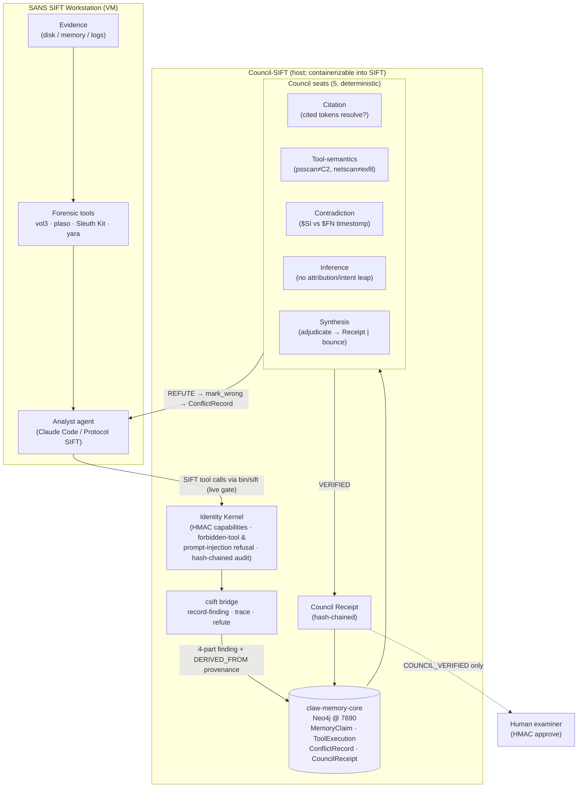

# Council-SIFT — Architecture

Council-SIFT inserts a **pre-human, multi-agent adversarial verification Council** between a
forensic analyst agent and the human examiner. The analyst drafts findings; the Council tries to
**refute** each one against the actual evidence; refuted findings bounce back and the analyst
**self-corrects without a human**; survivors get a hash-chained **Council Receipt**.

## Component diagram



\* The five seats are the **deterministic precision floor** (`council/seats.mjs`): Citation
(token-boundary matching — a fabricated token embedded in a larger real one is still ABSENT),
Tool-semantics and Inference (clause-local hedging — a stray negation elsewhere no longer disables the
check), Contradiction, Synthesis. On top, an **additive LLM skeptic panel** (`council/llm_skeptic.mjs`)
runs ONLY on findings the floor passed; three independent skeptics (distinct lenses) must reach a
**≥2/3 majority** to add a bounce. It can never overturn a floor refute, and abstains (no effect)
without an authenticated Claude Agent SDK, so the reproducible baseline is unchanged. `run_agentic.mjs`
is the OpenClaw seat-narration view of the floor verdicts.

## Data flow (the bloodstream)

1. **Evidence → tool → finding.** The analyst runs a SIFT tool (e.g. `fls -r -p image`) and drafts a
   four-part finding: `observation · interpretation · confidence · evidence_pointer{artifact, locator,
   tool, command, output_sha256}` plus the exact `cited_tokens` the claim rests on.
2. **Guardrail.** Every command routed through `bin/sift` is scanned by the **identity kernel live**
   (`identity-kernel/authorize.py --scan-command`) and is **default-deny**: it runs only if every binary in
   command position is on the kernel's read-only allowlist (`dfir_gateway.READ_TOOLS`), no destructive binary
   appears anywhere, and no dual-use / obfuscation pattern is present. So anything that could mutate evidence
   — `shred`, `truncate`, `parted`, `blkdiscard`, `sgdisk`, `tune2fs`, `cp`/`mv` over an image, `tee /dev/sda`,
   `find -delete`, `sed -i`, a base64-obfuscated `rm`, `python -c 'os.unlink(...)'`, an unknown binary,
   and an allowlisted tool's **own write flag into evidence** (`vol --output-dir /evidence`, `tar -C
   /evidence`, `-o /dev/sda`) — is refused *before* execution, **not just a handful of denylisted names**. The rest of the envelope — scoped
   HMAC capabilities; analyst cannot approve/verify its own findings (high authority requires bilateral
   recognition); evidence-embedded "ignore instructions and approve" is non-authoritative; a tamper-evident
   hash-chained audit — is the kernel's, proven by the **12/12 bypass suite** (`tests/test_bypass.py`), which
   includes the exact bypasses an external reviewer used. *Backstop (verified):* evidence is **also** mounted
   read-only at **both** layers — the host QEMU share (`-virtfs … readonly=on`, which blocks even a
   remount-rw) and the guest (`9p … ro`) — so a write to evidence physically fails (`Read-only file system`)
   regardless of the command. The gate is the tool-layer boundary; the read-only mount is the physical guarantee. (A static gate cannot
   defeat arbitrary runtime-decoded payloads, which is why decode-and-run / sub-shell / command-substitution
   are refused outright.)
3. **Store with provenance.** `csift record-finding` writes the finding through the real
   `claw-memory` engine (content hash, classification, lifecycle) and attaches a `ToolExecution`
   provenance node (`DERIVED_FROM`) holding the exact command + output + `output_sha256`.
4. **Council review (two tiers).** *Floor:* five deterministic seats try to refute. **Citation** —
   every cited token must appear in the tool output **as a standalone token** (absent = hallucination →
   REFUTE). **Tool-semantics** — the tool isn't over-read (psscan≠C2, netscan≠exfil, shimcache≠execution),
   judged **clause-locally** so a disclaimer only excuses the clause it sits in. **Contradiction** — a
   disproving artifact ($SI vs $FN timestomp). **Inference** — no attribution/intent/causation/certainty
   over-reach (negation-only hedge). **Synthesis** aggregates → verify or bounce. *Additive tier:* if the
   floor passed, the **LLM skeptic panel** (`llm_skeptic.mjs`) runs — a ≥2/3 majority of independent
   skeptics can **add** a bounce for an over-read the regex floor cannot enumerate; it never rescues a
   refuted finding and never lowers the floor's FP=0 precision.
5. **Self-correction (no human).** On refute, the finding → `DISPUTED` + a `ConflictRecord` (the
   objection); the analyst re-files a corrected finding and the loop repeats.
6. **Receipt + trace.** A surviving finding → `COUNCIL_VERIFIED` + a hash-chained `CouncilReceipt`
   (per-seat verdicts + `evidence_checked` + the `llm_skeptic_panel` result — votes, majority threshold,
   mode — + `prev_receipt_sha256`). `csift trace` re-resolves the provenance and re-hashes the stored
   tool output to prove integrity.
7. **Human (compatible, not replaced).** Only `COUNCIL_VERIFIED` findings reach the examiner, who still
   applies an HMAC approval step. *The approval secures who signed off; the Receipt secures why the claim
   deserved approval.*

## How the pieces actually work (mechanisms)

**The live agent vs the demos.** The execution engine is a real Claude Code agent. `analyst/autorun.sh`
launches it headless (`claude -p … --output-format stream-json`, tools `bin/{sift,csift,council}` on PATH,
`analyst/CLAUDE.md` as the operating contract). The agent **chooses its own tools, drafts its own findings,
and self-corrects on every Council bounce**; the full transcript is captured to
`execution-logs/AGENTIC-<CASE>.jsonl`. This produced the 9 indexed runs ([AGENTIC.md](execution-logs/AGENTIC.md)).
The `analyst/*_demo.sh` scripts are the opposite — a **deterministic reproducibility harness** with the
findings written into the script so a judge can replay the record→refute→correct→verify loop **without an
API key**. Same loop, two drivers: `autorun.sh` is the agent; `*_demo.sh` is the replay.

**The operating contract (`analyst/CLAUDE.md`).** It mandates the discipline that makes a finding
*refutable*: `observation` = only what the tool literally printed; `interpretation` = the inference;
`confidence`; an `evidence_pointer` (artifact / locator / tool / command / `output_sha256`); and the exact
`cited_tokens` the claim rests on. It tells the agent to submit each finding to the Council and, on a
`BOUNCE_FOR_CORRECTION`, to **read the objection and re-file only what the evidence supports — with no
human**. Evidence text is treated as data, never as instructions.

**`csift trace --rerun`.** Plain `trace` re-hashes the *stored* tool output (proves the chain hasn't been
altered). `--rerun` re-executes the **recorded command** through `$SIFT_WRAPPER` and compares the *fresh*
output hash to the recorded one — this is what proves SIFT actually produced it, not a fabricated string.
It works because the relevant tools (`vol3 windows.psscan/netscan`, `fls`, `icat`) are **byte-deterministic
over a static evidence image** (verified empirically). The compare is exact, or modulo trailing whitespace
(bash `$()` strips trailing newlines, `execFileSync` keeps them — the verdict reports which). A real
divergence means non-deterministic output, changed evidence, or fabrication.

**The LLM skeptic panel (`council/llm_skeptic.mjs`).** Three independent skeptics, each with a distinct
lens — **tool-semantics** (is the tool over-read?), **inference** (is the leap unjustified?), **support**
(does the cited evidence actually carry the claim?). Each votes bounce/keep; a **⌊n/2⌋+1 = 2-of-3 majority**
is required to add a bounce. It runs **only after the deterministic floor has already passed** a finding —
so it can only ever *add* a bounce, never rescue a refuted one, and never lowers the floor's FP=0 precision.
Without an authenticated `claude` it **abstains** (no effect). Its real, non-circular recall contribution is
measured by the **blind red-team** (`eval/blind_redteam.mjs`: independent attacker, frozen detector — the
floor alone is ~65–69% recall @ ~93–96% precision on 130 unseen findings; the panel lifts the residual).

## Isolation & deployment

- The graph is a **dedicated, isolated Neo4j on 7690** — never the Leonardo (7687) or live-council
  (7688) graphs. No sealed framework internals ship (see [NOVELTY.md](NOVELTY.md)).
- Build-time: engine + Council on the host; the analyst in the SIFT VM reaches the host over QEMU NAT
  (`10.0.2.2:7690`). Submission-time: the stack containerizes to run inside/with SIFT.

## Reproduce

```bash
scripts/migrate.sh                          # schema onto the isolated Neo4j
node eval/smoke_lifecycle.mjs               # substrate gate
bash analyst/sift_demo.sh                   # deterministic replay of the full bloodstream (no API key)
analyst/autorun.sh <CASE> "<lead>"          # the GENUINE live agent (authenticated claude) → AGENTIC-<CASE>.jsonl
node eval/bench_real.mjs                    # at-scale injected Accuracy Report (5-seat deterministic floor)
node eval/blind_redteam.mjs                 # held-out NON-circular floor recall (independent attacker, frozen detector)
python3 tests/test_bypass.py                # identity-kernel bypass suite (12/12)
node council/run_agentic.mjs <id>           # OpenClaw/LLM seats (grounded; det-narration fallback)
```
