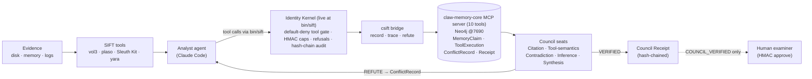

# Council-SIFT

> **An adversarial verification Council for autonomous DFIR.**
> It secures the *reasoning* — refuting unsupported findings against the real evidence and forcing the
> analyst to self-correct **before** a human ever signs off.


Council-SIFT is a verification layer for autonomous SIFT investigations. A Claude Code analyst
chooses forensic tools and drafts findings; the Council tries to refute each finding against the
actual tool output. Unsupported claims are bounced, the analyst self-corrects without a human, and
surviving findings get hash-chained receipts back to the exact command output.

The review/memory substrate includes a Model Context Protocol (MCP) server in
`claw-memory-core/src/mcp/index.ts` exposing 10 tools (`remember`, `recall`, `forget`,
`what_do_you_know_about`, `supersede`, `mark-wrong`, `list-sources`, `recall_at_time`,
`list_memories`, `corroborate`) over the isolated Neo4j provenance graph.

## Judges start here — 5-minute path

**What to remember:** Council-SIFT does not claim to be a one-click case oracle. It makes autonomous
DFIR findings harder to hallucinate by forcing every claim through evidence-grounded Council review
before a human examiner sees it.

| Judge question | Fast answer | Where to verify |
|---|---|---|
| Is the agent real or scripted? | **Real agent:** 9 Claude Code investigations across disk + memory; the `analyst/*_demo.sh` files are only no-key replay harnesses. | [`execution-logs/AGENTIC.md`](execution-logs/AGENTIC.md) |
| Does it self-correct? | **Yes:** 10 live self-corrections; canonical demo is the SRL-2018 `Rar.exe` overclaim narrowed after Council bounce. | [One finding, end to end](#one-finding-end-to-end-what-the-loop-actually-does) |
| Does it reduce hallucinated IR findings? | **Yes, with scoped numbers:** injected unsupported claims go from **85/85 reaching review** to **0/85**; blind rescore is **98.6% recall / 98.6% precision** with 1 FP + 1 miss named. | [`accuracy-report/bench_real_report.md`](accuracy-report/bench_real_report.md) |
| Are the constraints architectural? | **Yes:** default-deny `bin/sift`, HMAC-scoped capabilities, no analyst self-approval, read-only evidence mount, tamper-evident audit. | `python3 tests/test_bypass.py`, `python3 eval/gate_redteam.py` |
| Can I run the core without API keys or evidence? | **Yes:** the core verification gates run locally with Docker + Node + Python. | [Setup](#setup-step-by-step), then commands below |

**Fast no-API-key smoke test after setup:**

```bash
set -a; source claw-memory-core/.env; set +a
node eval/smoke_lifecycle.mjs        # expect: SMOKE PASS
node eval/ablation.mjs               # expect: precision=1.000 recall=1.000
node eval/adversarial_evasions.mjs   # expect: 67/67 caught, 0/36 false positives
python3 tests/test_bypass.py         # expect: identity-kernel bypass suite: 13/13 passed
```

**Six-criterion scorecard in one glance:**

| Criterion | Signal |
|---|---|
| Autonomous execution | Claude Code is the primary engine; 9 real runs, 46 drafted findings, 10 self-corrections. |
| IR accuracy | Findings separate observation / interpretation / confidence / provenance; misses and false positives are disclosed. |
| Breadth + depth | Official ROCBA, SRL-2015, SRL-2018; disk via Sleuth Kit, memory/network telemetry via Volatility 3, and SRL-2018 timeline correlation via Plaso/psort. |
| Constraint implementation | 13/13 bypass suite + 52/52 destructive gate red-team refused; MCP-backed memory/review substrate exposes 10 tools. |
| Audit trail | Finding → ToolExecution + `output_sha256` → Council Receipt → MCP-backed memory graph → `trace` / optional `trace --rerun`. |
| Usability | No-key core runs locally; official-evidence demos need SIFT + organizer datasets. |

<details>
<summary><strong>Scope and honesty notes</strong> — why the numbers are careful rather than inflated</summary>

Council-SIFT is **complementary** to a human HMAC-approval step (such as the reference Valhuntir
submission): it feeds that step only findings that already survived verification. It secures the
**correctness** of the reasoning — *why a finding deserved approval* — the layer left to the human today.

It runs on two tiers:

1. a **deterministic floor**, reproducible by any judge with no API key, whose refutations are mechanically
   verifiable (for example, "the cited token `185.220.101.45` is not in the tool output"); and
2. an **additive LLM skeptic panel** (OpenClaw / Claude-Agent-SDK) that lifts recall on over-reads no regex
   can enumerate.

The panel can only **add** a bounce to a finding the floor already passed; it can never rescue a refuted
finding. A bounce requires a ≥2-of-3 independent-skeptic majority, so one trigger-happy LLM cannot reject
a real finding.

The hardened evasion suite catches **67/67** with **0/36** false positives on natural-prose guards, but that
suite was used to harden the seats, so it is reported as a regression test, not the held-out benchmark. The
held-out, non-circular number comes from [`eval/blind_redteam.mjs`](eval/blind_redteam.mjs): an independent
LLM attacker wrote 130 fresh findings (56 supported · 74 hallucinated). The current detector rescore catches
**73/74** unsupported findings (**98.6% recall**) at **98.6% precision**, with one false positive and one miss
listed rather than hidden.

</details>

---

## 🔴 Live autonomous agent — across disk *and* memory (the primary execution engine)

The Council is the novel verification layer, but the **execution engine is a genuine Claude Code agent.**
Driven by [`analyst/autorun.sh`](analyst/autorun.sh), it reads its contract, **chooses its own tools**,
drafts its **own** findings, submits them to the Council, and **self-corrects on every bounce — no human,
nothing hardcoded.** We ran it across evidence types and cases:

| Case | Evidence | Findings | Verified | Self-corrected | Agent-found artifact |
|---|---|---:|---:|---:|---|
| SRL18-DC-DISK | disk / MFT | 8 | 4 | **4** | `ntds.dit` domain credential dump staged in `C:\temp` (`ntdsutil ifm`) |
| SRL18-FILE-DISK | disk / MFT | 6 | 5 | 1 | `StarFury.zip` archive/staging artifact (+ deleted RAR subtree, MFT carving) |
| ROCBA-DISK | disk | 5 | 5 | 0 | Stark Research Labs IP-theft files in `fredr`'s profile |
| SRL18-WKSTN-MEM | memory (8 vol3 plugins) | 4 | 4 | 0 | LISTENING backdoor socket; `subject_srv.ex` Wow64 process |
| SRL18-RD-NET | memory / network | 8 | 5 | **3** | `subject_srv.ex` backdoor `0.0.0.0:3262`; suspicious `powershell.exe` |
| ROCBA-MEM | memory | 3 | 3 | 0 | `svchost.exe` socket ownership; 118 inbound TCPv4 records |
| SRL2015-NFURY | memory **+** disk | 9 | 8 | 1 | PyInstaller malware, recycled `svchost.exe` masquerade, `winclient.reg` persistence |
| SRL-LIVE | memory | 1 | 1 | 0 | disciplined first pass — picked `subject_srv.ex` over the obvious `Rar.exe` |
| SRL-LIVE2 | memory / network | 2 | 1 | 1 | corrected an internal-IP "C2" over-read live; re-ran the tool itself |

**9 genuine runs · 46 drafted findings · 36 Council-verified · 10 live self-corrections · disk, memory, and network telemetry ·
3 cases (SRL-2018, ROCBA, SRL-2015).** ROCBA alone was explored through 30+ iterative Council-SIFT investigation/correction rounds; the public repo ships curated verified receipts and narrative reports rather than raw scratch.
Real redacted transcripts (tool calls + timestamps + token usage), per-case
investigative narratives, and hash-chained receipts — indexed in
**[`execution-logs/AGENTIC.md`](execution-logs/AGENTIC.md)** with narratives in [`reports/`](reports/).
The deterministic `*_demo.sh` scripts are a separate **no-API-key reproducibility harness**, not the agent.
The bounded [`analyst/srl_timeline_demo.sh`](analyst/srl_timeline_demo.sh) add-on runs real Plaso/psort over the official
SRL-2018 file-server disk to show the disk/timeline correlation the memory correction calls for.

### One finding, end to end (what the loop actually does)

On the SRL-2018 file-server memory image, the agent ran `vol3 windows.psscan` and drafted:

> **observation:** `vol3 windows.psscan shows Rar.exe PID 2524 (parent 6352) … on the file server`
> **interpretation:** *"Rar.exe **exfiltrated the stolen SRL data to the attacker's external C2 server**"* · **confidence:** HIGH · **cited_tokens:** `2524`, `Rar.exe`, `6352`

The Council **bounced it** — two seats, independently:
- **Tool-semantics:** *a process listing (psscan) cannot establish network activity; netscan is required to claim C2.*
- **Inference:** *attribution to a specific actor cannot be drawn from one artifact.*

The analyst read the objection and **self-corrected with no human**, re-filing only what the evidence supports:

> **interpretation:** *"Rar.exe is an archiving utility; its execution is a **data-staging indicator that warrants disk/timeline correlation** — exfiltration is **NOT** established from a process listing alone"* · **confidence:** MEDIUM

→ all seats SUPPORTED → **COUNCIL_VERIFIED** + a hash-chained Receipt. `csift trace --rerun F-analyst-SRL-MEM-002`
(requires the isolated Neo4j graph at `bolt://localhost:7690`; see [Setup](#setup-step-by-step) steps 2–4)
re-executes the recorded `vol3` command and confirms the output hash matches. *(On disk, the file-server run
then found the actual `StarFury.zip` archive/staging artifact — corroborating the staged-archiving read on a second evidence type.)*

---

## ✅ Submission compliance (FIND EVIL!) — where each required item lives

| Required item | Location / status |
|---|---|
| Public code repository | [`https://github.com/davfd/council-sift`](https://github.com/davfd/council-sift) — clean public snapshot on `main`; do not push local archive refs |
| **Open-source license (MIT)** | [`LICENSE`](LICENSE) — MIT, detected by GitHub → shown in **About** |
| README with setup | this file → **[Setup](#setup-step-by-step)** |
| Step-by-step run instructions against evidence | **[Setup](#setup-step-by-step)** + **[Run the demos](#run-the-demos)** |
| Text description (features/functionality) | this README + [`ARCHITECTURE.md`](ARCHITECTURE.md) + [`NOVELTY.md`](NOVELTY.md) |
| Demonstration video (<5 min, terminal, self-correction) | Operator-owned final URL goes on Devpost; final cue card ready at [`docs/FINAL_RECORDING_CUE_CARD.md`](docs/FINAL_RECORDING_CUE_CARD.md), longer rationale at [`docs/DEMO_SCRIPT.md`](docs/DEMO_SCRIPT.md) |
| Architecture diagram | [`docs/architecture.png`](docs/architecture.png) + [`docs/architecture.svg`](docs/architecture.svg) + mermaid in [`ARCHITECTURE.md`](ARCHITECTURE.md) and below |
| Evidence Dataset Documentation | [`evidence-docs/EVIDENCE.md`](evidence-docs/EVIDENCE.md) |
| Accuracy Report | [`accuracy-report/bench_real_report.md`](accuracy-report/bench_real_report.md) (`node eval/bench_real.mjs` regenerates, at scale on real evidence) |
| Agent Execution Logs | **[`execution-logs/AGENTIC.md`](execution-logs/AGENTIC.md)** — index of **9 genuine autonomous runs** (real stream-json transcripts: tool calls + timestamps + token usage); structured per-case logs via `node eval/export_execution_log.mjs <case>` |
| Devpost copy / operator packet | [`docs/DEVPOST_SUBMISSION_COPY.md`](docs/DEVPOST_SUBMISSION_COPY.md) + [`docs/SUBMISSION_PACKET.md`](docs/SUBMISSION_PACKET.md) |
| Analytical reasoning (structured investigative narrative, not a raw log) | [`reports/`](reports/) — `node eval/narrative_report.mjs <case>` renders verified findings as analyst prose (confidence, what the evidence does *not* support, self-correction record, receipt links) |

**Success metric (per the organizers): *fewer hallucinated findings than Protocol SIFT's baseline.***
We measure it directly on **real tool output from all three official scenarios** (ROCBA + SRL-2015 +
SRL-2018, dozens of hosts): **Council-OFF = the Protocol SIFT baseline** lets every injected
unsupported claim reach the human; **Council-ON** catches all 85 injected unsupported claims with
**zero false positives on that injected-class supported set**. The blind red-team rescore separately shows
98.6% recall / 98.6% precision (1 FP, 1 FN), so these numbers are scoped, not a global accuracy claim. See [`accuracy-report/bench_real_report.md`](accuracy-report/bench_real_report.md) — regenerate
with `node eval/bench_real.mjs`.

---

## How we hit the judging criteria

| Criterion | How Council-SIFT addresses it |
|---|---|
| **Autonomous Execution Quality** | The analyst (Claude Code) drafts → Council refutes → analyst **self-corrects with no human** → re-review → Receipt. Demonstrated on synthetic + official disk + official memory. |
| **IR Accuracy** | Findings split into observation / interpretation / confidence; hallucinations are **caught and recorded** (not silently dropped); 4 distinct error classes detected (below). Benchmarked **at scale on real evidence across all 3 official scenarios** — 0 FP on the injected-class supported set, with blind red-team precision reported separately (see the Accuracy Report). |
| **Breadth & Depth** | Depth over breadth: deep on **memory (Volatility 3)**, **disk (Sleuth Kit)**, **timeline correlation (Plaso/log2timeline + psort)**, and memory-derived **network telemetry** across official ROCBA + SRL datasets. No standalone PCAP was found in the mounted official evidence, so packet payload analysis is not claimed. |
| **Constraint Implementation** | An **architectural, default-deny** identity kernel enforced **live at `bin/sift`**: a command runs only if every binary is on the read-only allowlist — everything else (`shred`, `truncate`, `parted`, `cp`/`mv` over an image, `find -delete`, `sed -i`, an obfuscated `rm`, an unknown binary) is refused *before* execution, with dual-use + obfuscation guards. Plus HMAC-scoped capabilities, no self-approval, prompt-injection refusal, tamper-evident audit, and a 10-tool **Model Context Protocol (MCP)** memory/review surface. Evidence is **also** mounted read-only (OS-enforced backstop). **13/13 bypass suite** — incl. the exact bypasses a reviewer used. |
| **Audit Trail Quality** | Every finding → `DERIVED_FROM` tool-execution node (+ `output_sha256`); Tier 3 adds `csift capture` trusted execution records so new findings import tool stdout from a hash-verified local capture instead of trusting caller-supplied `output`; `csift trace` re-hashes stored output, and `trace --rerun` is the stronger optional check for concrete recorded commands/evidence paths (canonical demo: `F-analyst-SRL-MEM-002`); timestamped execution logs; hash-chained Receipts. |
| **Usability & Documentation** | One-command demos; reproducible core needs no API key; clean, seed-free MIT repo; this README. |

**Mandatory Project Requirements:** self-correction without a human ✓ · accuracy traceable to
artifact/offset/log ✓ · structured investigative narrative (not a raw log) ✓ — generated from the
verification substrate by `node eval/narrative_report.mjs <case>` → [`reports/<case>.md`](reports/): an
analyst-style report (reasoned prose, confidence, *what the evidence does **not** support*, the
self-correction record, each claim linked to its receipt plus `trace`/rerun checks where the recorded
command is concrete), distinct from the raw
[`execution-logs/`](execution-logs/) event streams.

---

## Architecture



Full diagram + data flow: [`ARCHITECTURE.md`](ARCHITECTURE.md) · raster image: [`docs/architecture.png`](docs/architecture.png) · vector image: [`docs/architecture.svg`](docs/architecture.svg).

## The loop (bloodstream)

```
evidence → `csift capture` runs the forensic command through `bin/sift` and writes a hash-verified local execution record
         → analyst drafts a 4-part finding (observation / interpretation / confidence / execution_ref)
         → `record-finding` imports the captured stdout, refuses caller-supplied output, and stores DERIVED_FROM provenance + output_sha256
         → Council seats try to REFUTE it
         → if refuted: ConflictRecord + bounce → analyst SELF-CORRECTS (no human)
         → if it survives: hash-chained Council Receipt
         → `trace` re-resolves the pointer and re-hashes the tool output (integrity)
```

---

## What we proved (on real evidence)

| Demo | Evidence | Outcome |
|---|---|---|
| `analyst/rocba_demo.sh` | **Official ROCBA** `rocba-cdrive.e01` (real NTFS, Sleuth Kit, zero-copy) | Fabricated "BitLocker container @ inode 999999" → **Citation refutes** (absent) → self-correct → **VERIFIED** → trace integrity VERIFIED |
| `analyst/srl_memory_demo.sh` | **Official SRL-2018** `base-file-memory.img` (real **Volatility 3 psscan**) | "Rar.exe → exfiltrated to the attacker's C2" → **caught by Tool-semantics + Inference** → self-correct → **VERIFIED** |
| `analyst/srl_timeline_demo.sh` | **Official SRL-2018** `base-file-cdrive.E01` (real **Plaso/log2timeline + psort** plus Sleuth Kit `fls`/`istat`) | `StarFury.zip` and rare-earth documents placed in a bounded timeline; live + deleted archive entries corroborate staging while preserving the boundary: no PCAP payload, no completed-exfil receipt, no human identity claim. |
| `analyst/rocba_questions_demo.sh` | **Official ROCBA** `Users/fredr` (real `fls`) | Works the case's *Key Questions*; "8.4 GB → 185.220.101.45" **refuted**; evidence-grounded brief (open questions stay open) |
| `analyst/sift_demo.sh` | synthetic ext4 image in SIFT (real `fls`) | inode-99 rootkit claim refuted → self-correct → VERIFIED |
| `eval/bench_real.mjs` | **real** Sleuth Kit + vol3 output, **all 3 official scenarios** (ROCBA + SRL-2015 + SRL-2018, many hosts) | Council **OFF: every injected unsupported claim reaches review → ON: caught**; **FP=0 on the injected-class supported set** — see the Accuracy Report |
| `eval/ablation.mjs` | small labelled sanity set (memory/disk/hash) | Council **OFF 6/6 → ON 0/6** |
| `eval/adversarial_evasions.mjs` | red-team regression suite phrased to dodge the seat vocabulary + substring/zero-token/PID/scope/RFC1918/causation exploits | hardened floor **67/67 caught, 0/36 FP** (regression test, not held-out) |
| `eval/gate_redteam.py` | broad live-gate red-team — 52 evidence-destruction attempts across 9 evasion classes (encoding/eval, indirection, interpreters, wrappers, path-prefixed, quoting, archive-extract, tool-native writes, redirects) | **all 52 refused, 0 false-denies** |
| `eval/blind_redteam.mjs` / `eval/blind_rescore.mjs` | **held-out, non-circular** — independent LLM attacker corpus, current detector rescore of 130 unseen findings | deterministic floor **98.6% recall @ 98.6% precision** (73/74 unsupported caught, 1 FP, 1 miss listed) |
| `eval/skeptic_panel_test.mjs` | additive-panel gate logic (mocked votes, no API key) | 2/3→bounce · 1/3→pass · abstains w/o auth · additive-only |
| `eval/skeptic_live_demo.mjs` | **live** LLM panel on second-order evasions that pass the hardened floor | majority **bounces over-reads the floor missed**; **0 FP** on disciplined findings |
| `tests/test_bypass.py` | identity kernel | **13/13** (self-approve blocked, evidence prompt-injection refused, forged/expired/scope caps, shell-token bypass regression, tamper-evident audit) |

---

## Setup (step by step)

**Prerequisites**
- **Docker** (for the isolated Neo4j), **Node ≥ 20**, **Python ≥ 3.10**.
- For the SIFT demos: a **SANS SIFT Workstation** you can reach over SSH, and (for the official-evidence
  demos) the HACKATHON-2026 datasets. The repo never contains evidence.

```bash
# 1. clone
git clone https://github.com/davfd/council-sift council-sift && cd council-sift

# 2. isolated Neo4j (its own graph — never your other graphs)
docker run -d --name councilsift-neo4j -p 7690:7687 -p 7476:7474 \
  -e NEO4J_AUTH=neo4j/councilsiftpw -e NEO4J_PLUGINS='["apoc"]' neo4j:5.26-community

# 3. build the audit-substrate engine
cd claw-memory-core && npm install --legacy-peer-deps --no-audit && npm run build && cd ..

# 4. point the engine at the isolated graph
printf 'NEO4J_URI=bolt://localhost:7690\nNEO4J_USER=neo4j\nNEO4J_PASSWORD=councilsiftpw\n' > claw-memory-core/.env

# 5. apply the schema (runs cypher-shell inside the container — no host install needed)
bash scripts/migrate.sh
```

### Run the demos

**Core verification — no SIFT/API key required (runs anywhere):**
```bash
set -a; source claw-memory-core/.env; set +a
node eval/smoke_lifecycle.mjs        # substrate: deposit → refute → ConflictRecord → corrected claim
node eval/ablation.mjs               # quick sanity ablation (small labelled set)
node eval/adversarial_evasions.mjs   # red-team regression: 67/67 caught, 0/36 FP (token-boundary + narrowed hedging + Tier 2 scope/PID/RFC1918 + causation checks)
node eval/trusted_execution_test.mjs  # Tier 3: trusted execution records + caller-supplied-output refusal
node eval/bounded_skeptic_prompt_test.mjs # Tier 3: LLM panel sees bounded evidence excerpts, not unbounded raw output
node eval/skeptic_panel_test.mjs     # additive-panel gate logic with mocked votes (2/3→bounce, 1/3→pass)
python3 tests/test_bypass.py         # identity-kernel bypass suite (13/13)
# Pure no-SIFT checks stop here. `trace --rerun` needs a demo receipt plus SIFT wrapper/evidence path.
```

**Forensic demos — point the analyst at your SIFT Workstation.** Edit `bin/sift` so it SSHes to your
SIFT box (the wrapper is a thin `ssh … "$@"`), then:
```bash
export PATH="$PWD/bin:$PATH"
bash analyst/sift_demo.sh            # synthetic image, real Sleuth Kit, full self-correction loop
# official evidence (mount read-only first; nothing is copied):
#   launch the SIFT VM with: -virtfs local,path=<EVIDENCE_DIR>,mount_tag=evidence,security_model=none,readonly=on
bash scripts/mount_evidence.sh
bash analyst/rocba_demo.sh           # official ROCBA disk (Sleuth Kit)
bash analyst/srl_memory_demo.sh      # official SRL-2018 memory (Volatility 3)
bash analyst/srl_timeline_demo.sh    # official SRL-2018 file-server timeline (Plaso/psort + Sleuth Kit)
# after the memory demo records F-analyst-SRL-MEM-002 in the isolated graph:
node bridge/csift.mjs trace --rerun F-analyst-SRL-MEM-002
# Receipt rerun honesty: council/receipts/manifest.json labels placeholder/prose-command receipts
# as STORED_OUTPUT_ONLY; `trace --rerun` reports NOT_RERUNNABLE for those instead of pretending they rerun.
# at-scale Accuracy Report on REAL evidence (needs the corpus pulled from SIFT — see evidence-docs):
#   node eval/bench_real.mjs
bash analyst/rocba_questions_demo.sh # official ROCBA "Key Questions" + evidence-grounded brief
```

**Live autonomous analyst (genuine self-correction) — needs an authenticated Claude Code.** This is the
**primary execution engine** and how the 9 indexed runs in [`AGENTIC.md`](execution-logs/AGENTIC.md) were
produced (the agent reads [`analyst/CLAUDE.md`](analyst/CLAUDE.md), **chooses its own tools**, drafts its
**own** findings — nothing hardcoded):
```bash
export PATH="$PWD/bin:$PATH"
# Headless — reproduce/extend a genuine run (real Claude Code stream-json captured to execution-logs/AGENTIC-<CASE>.jsonl):
analyst/autorun.sh SRL18-DC-DISK "Triage the DC C-drive E01 at <path> for compromise/persistence; submit findings to the Council."
analyst/process_run.sh SRL18-DC-DISK   # redact transcript → investigative narrative (reports/) → structured execution log → trace
# Interactive — drive the same agent yourself in a Claude Code session:
bash analyst/run.sh                    # launches Claude Code with analyst/CLAUDE.md + sift/csift/council on PATH
#   then prompt: "Case DEMO. Evidence: <path>. Investigate and submit findings to the Council; self-correct on any bounce."
```
*(The deterministic `*_demo.sh` scripts above are a separate no-API-key reproducibility harness with
**hardcoded** findings — they re-play the loop for a judge without credentials. `autorun.sh` is the **real
agent**: tool choices and findings are the model's own.)*

**Additive LLM skeptic panel (lifts recall on over-reads no regex catches):**
```bash
# Enable the panel on the live review path — it runs ONLY after the deterministic floor passes,
# bounces only on a ≥2/3 skeptic majority, and abstains (no effect) without an authenticated `claude`:
COUNCIL_LLM_SKEPTIC=1 node council/council.mjs review <finding_id>
node eval/skeptic_live_demo.mjs              # live: panel bounces second-order evasions the floor passed, 0 FP
node eval/blind_redteam.mjs                  # private/auth path: independent LLM attacker over the blind corpus
node eval/blind_rescore.mjs                  # requires eval/corpus/ or embedded outputs; public snapshot fails closed and preserves the committed report
node council/run_agentic.mjs <finding_id>    # OpenClaw seat narration view (Claude Agent SDK if authenticated)
```

---

## Components

| Path | Role |
|---|---|
| `claw-memory-core/` | Seed-free Neo4j audit substrate (MemoryClaim / ToolExecution / ConflictRecord / VerificationRecord / CouncilReceipt; append-only; `content_sha256`; provenance edges). Vendored foundation. |
| `identity-kernel/` | Architectural guardrail — HMAC-scoped/expiring capabilities, forbidden-tool + prompt-injection refusal, bilateral approval, tamper-evident hash-chained audit. `kernel.py` (layered gateway), `dfir_gateway.py` (the DFIR policy: read/high-authority/forbidden tool sets + relations), `authorize.py` (the **live** `--scan-command` gate `bin/sift` calls). |
| `council/seats.mjs` | The deterministic verifier seats (**precision floor**) — token-boundary citation, tool semantics, contradiction, inference, and scope. |
| `council/trusted_execution.mjs` | Tier 3 trusted-execution utilities: hash-verified `csift capture` records, caller-supplied-output refusal, and bounded evidence excerpts. |
| `council/llm_skeptic.mjs` | The **additive** LLM skeptic panel — 3 independent lenses, ≥2/3 majority, abstains with no auth; sees bounded evidence excerpts plus full-output hash, not unbounded raw stdout. |
| `council/council.mjs` | Review loop: deterministic floor → (if passed) additive LLM panel → bounce or hash-chained Receipt. |
| `council/run_agentic.mjs` | Agentic (OpenClaw / Claude-Agent-SDK) seats, grounded in the same checks. |
| `council/agents/` | OpenClaw seat definitions (persona + mandate + grounding tool). |
| `analyst/CLAUDE.md` | The analyst's **operating contract** — the 4-part finding discipline (observation vs interpretation vs confidence + `cited_tokens`) and the self-correct-on-bounce loop that make findings refutable. |
| `analyst/autorun.sh`, `analyst/process_run.sh` | **The genuine live agent** — headless launcher that ran the 9 indexed investigations + the post-processor (redact → narrative → execution log). |
| `analyst/run.sh`, `analyst/*_demo.sh` | Interactive agent launcher + the deterministic (hardcoded-finding) reproducibility demos. |
| `bridge/csift.mjs` | `capture` / `record-finding` / `trace [--rerun]` / `refute` / `list` over the engine. `capture` creates local trusted execution records; `record-finding` imports those records and refuses caller-supplied stdout. |
| `bin/` | `sift` (live identity-kernel gate) / `csift` / `council` PATH wrappers for the agent. |
| `eval/` | `smoke_lifecycle` · `ablation` (incl. the timestomp **Contradiction** case) · `bench_real` (at-scale injected bench) · **`blind_redteam.mjs`** (held-out non-circular floor recall, private/auth path) · `blind_rescore.mjs` (detector rescore when `eval/corpus/` or embedded outputs are present; public snapshot fails closed rather than fabricating an empty-output rescore) · `adversarial_evasions.mjs` (floor regression, 67/67) · `gate_redteam.py` (52/52 live-gate refusals) · `skeptic_panel_test`/`skeptic_live_demo` (panel) · `vigia_score.mjs` (external benchmark) · `narrative_report.mjs` · `redact_agentic.mjs` · `export_execution_log.mjs`. |
| `tests/test_bypass.py` | Identity-kernel bypass suite (13/13). |
| `evidence-docs/`, `accuracy-report/`, `execution-logs/`, `docs/` | The submission deliverables. |

## The forensic seats

| Seat | Refutation question | Verdict |
|---|---|---|
| **Citation** | Does every evidence token the claim *cites* appear in the tool output? | `UNSUPPORTED` (lists the absent/fabricated token) |
| **Tool-semantics** | Is the tool read correctly? (psscan ≠ C2, Shimcache ≠ execution…) — negation-aware | `MISREAD_TOOL` |
| **Contradiction** | Is there a disproving artifact? (e.g. timestomp `$SI` vs `$FN`) | `CONTRADICTED` |
| **Inference** | Does the interpretation over-reach? (attribution / intent / causation / unjustified certainty) | `UNSUPPORTED` |
| **Scope** | Does one artifact get stretched into all-hosts / environment-wide / organization-wide impact? | `UNSUPPORTED` |
| **Synthesis** | Adjudicate the panel → disposition | `COUNCIL_VERIFIED` \| `BOUNCE_FOR_CORRECTION` |

The five refutation seats above are the **deterministic floor** (`council/seats.mjs`, no API key). On top
sits the **additive LLM skeptic panel** (`council/llm_skeptic.mjs`), consulted **only on findings the
floor already passed**:

| Tier | What it does | Guarantee |
|---|---|---|
| **Deterministic floor** | The 5 refutation seats + Synthesis above; mechanical refutations | Reproducible; FP=0 on the injected-class regression supported set; blind red-team precision reported separately |
| **LLM skeptic panel** (additive) | 3 independent skeptics (tool-semantics / inference / scope lenses) catch over-reads with no regex trigger | **Only adds** a bounce to a floor-passed finding (never rescues); needs a **≥2/3 majority**; panel recall/FP is measured separately |

## Accuracy & honesty

The [Accuracy Report](accuracy-report/bench_real_report.md) is regenerated by `node eval/bench_real.mjs`
from **real Sleuth Kit + Volatility 3 output captured across the official ROCBA + SRL-2015 + SRL-2018
images (dozens of hosts)** — findings are grounded in real artifacts; ground truth = token
present-vs-absent in the real output. It ships with explicit **honesty notes**:
- **Precision / FP-rate on the injected-class regression set:** across the template-scoped supported findings,
  the Council raised **zero** false flags. The blind red-team rescore is the unseen precision signal and
  records 1 FP; do not read the regression FP=0 as a global guarantee.
- **Recall on the injected set is by-construction** (its hallucination classes map onto the seats) — so
  that number is **not** a substitute for an external key. We therefore keep the hardened floor regression
  suite ([`eval/adversarial_evasions.mjs`](eval/adversarial_evasions.mjs)): evasions phrased to dodge the seat
  vocabulary now pass at **67/67 caught, 0/36 FP**. Honestly, that suite was used to harden the seats, so
  it is a **regression test, not a held-out benchmark**.
- **The non-tuned recall signal is the blind corpus plus additive panel.** The persisted blind corpus now rescores at
  **98.6% recall / 98.6% precision** with 1 FP and 1 FN. On second-order evasions that pass even the
  hardened floor, a ≥2/3 skeptic majority bounces them — demonstrated **live**
  ([`eval/skeptic_live_demo.mjs`](eval/skeptic_live_demo.mjs)): it caught over-reads the floor passed
  while flagging **0/n** disciplined findings. Gate logic is proven deterministically with mocked votes
  ([`eval/skeptic_panel_test.mjs`](eval/skeptic_panel_test.mjs), no API key).
- **External benchmark (supporting evidence, scoped):** scored against community `vigia-cases`, but this path is
  a live LLM specificity-prompt comparison (`eval/vigia_score.mjs`), **not** the deterministic `runSeats`
  verifier. The `score_against` tier has 3 cases, all MALICE ground truth; both Council-OFF and Council-ON
  reached 100% verdict accuracy there, so the Council delta is ~0. False-positive gate PASS (VIGIA-REAL-005);
  IOC recall 85%; see [`accuracy-report/vigia_external_report.md`](accuracy-report/vigia_external_report.md).
- The benchmark itself **surfaced and fixed a real gap** (a netscan "connection = exfiltration to C2"
  over-read, often to loopback/internal IPs) — which is how it should be used.

## Novelty & provenance

`claw-memory-core` and the identity-kernel mechanism are a **pre-existing, seed-free, MIT foundation**
(documented in [`NOVELTY.md`](NOVELTY.md)). The **new hackathon work** is the DFIR claim schema, the
verifier seats, the self-correction loop against SIFT tools, the Council Receipt, the DFIR
identity envelope + bypass suite, the ablation, and the official-evidence integration. **No sealed
framework internals appear anywhere in this repository**, and the graph is an isolated instance.

## License

MIT — see [`LICENSE`](LICENSE).

## Acknowledgments

Built for the SANS **FIND EVIL!** hackathon, on the SANS SIFT Workstation and Protocol SIFT.
MITRE ATT&CK is a trademark of The MITRE Corporation; SIFT Workstation is a product of the SANS Institute.
